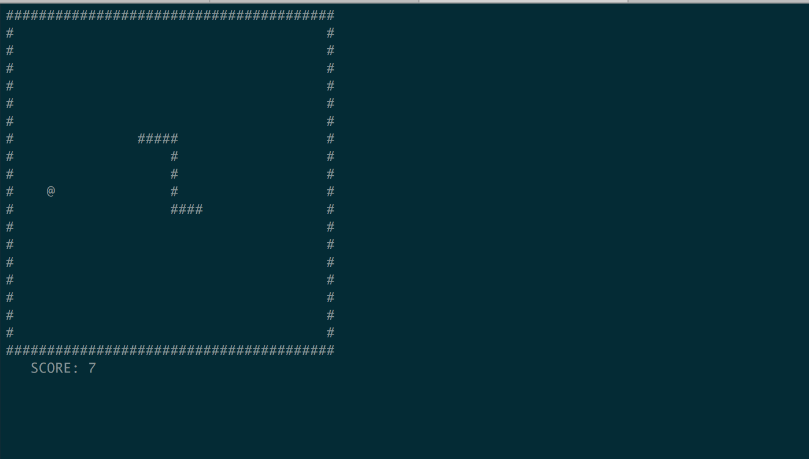

# C

## Dependencies
  - [ncurses](https://viget.com/extend/game-programming-in-c-with-the-ncurses-library)


## How to run?
```
$ make %% ./snake
```

## How it looks like?


## Notes on the language
 - The macros are dummy copy/paste code snippets. I had a lot of errors there because of the semicolon at the end of the line I put automatically (as I was taught in JS).
 - [Pointers](http://www.codingunit.com/c-tutorial-how-to-use-pointers). [Pointers](https://www.youtube.com/watch?v=JfSrHv0qAkw). [Pointers](http://www.praxagora.com/doc_model/understanding_c_pointers_1.0.html).
 - Switch works only on int (luckily there are enums).
 - No array methods like `.pop`, `.shift`, etc. There are basically no useful methods at all in C.

_20 February 2016_
