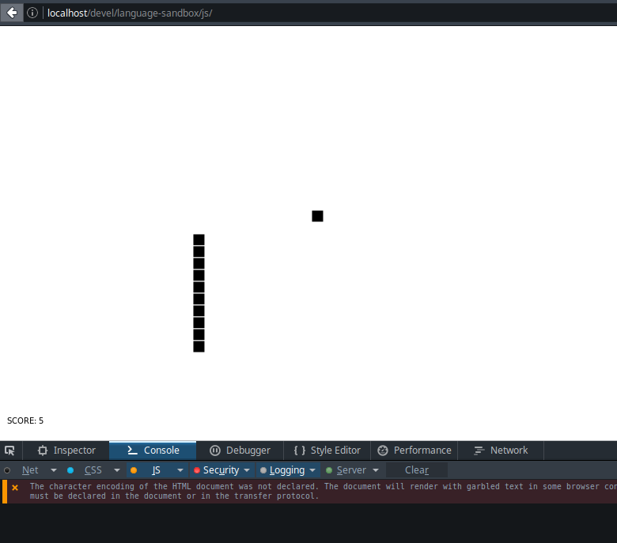

# JavaScript

## Dependencies
None

## How to run?
open `index.html` in the browser

## How it looks like?

## Notes on the language
  - I'm most familiar with JS so there will be no notes here

  
_05 January 2015_
