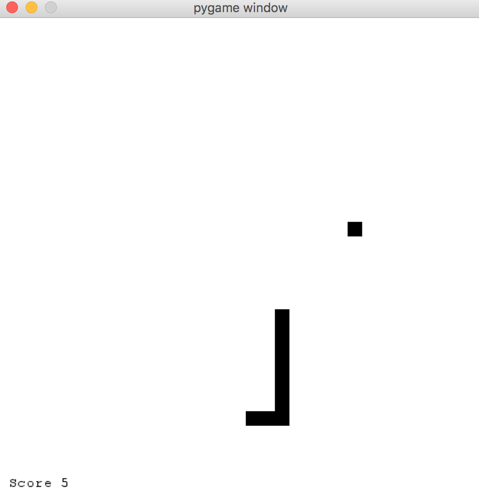

## Python

## Dependencies
  - [Pygame](http://www.pygame.org/download.shtml)

## How to run?
  - On MacOSX run with `arch -32 python snake.py`

## How it looks like?
  

## Notes on the language
  - No `++` & `--` operators, just `+=1`, `-=1`
  - No extra attributes like `length` on lists - list length with `len(list)`
  - Get dict values with `.get('value')` `or dict['value']`, not `dict.value`
  - `global` keyword to modify global scope
  - No switch statement (wow)
  - `.pop()` can return every element of the array
  - Non-intuitive `elif` instead of `else if` or `elseif`
  - Dict keys in apostrophes (`{'x': i, 'y':0}`)
  - Waaaay nicer random functions than JS, like `.randrange()`

_13 January 2015_
